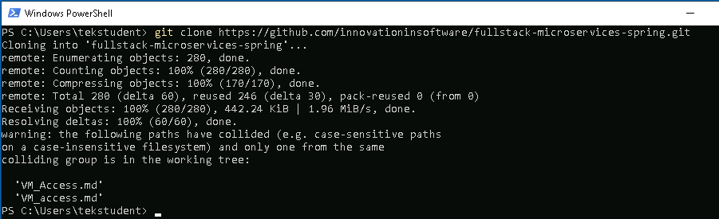
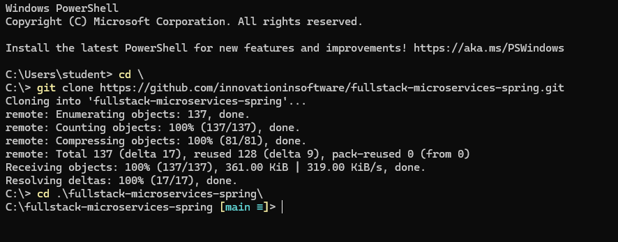

# Welcome
This is your guid to the labs. To start with, you will need to clone the repository that contains all the lab files and instructions.

1. Run Visual Studio Code
2. Click the GitHub icon on the right panel.
3. Change to the root of drive c:
```
cd \
```
4. Clone the git repostory `git clone https://github.com/innovationinsoftware/fullstack-microservices-spring.git`



5. Change into the new directory.



6. Run VS Code. `code .`

You are now ready to start the labs.

# Labs
- [Lab 1 - Polygot](./lab-1/README.md)
- [Lab 2 - Discovery](./lab-2/README.md)
