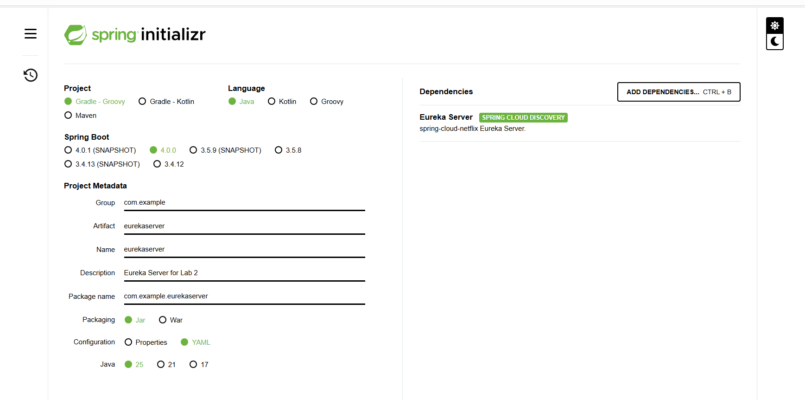
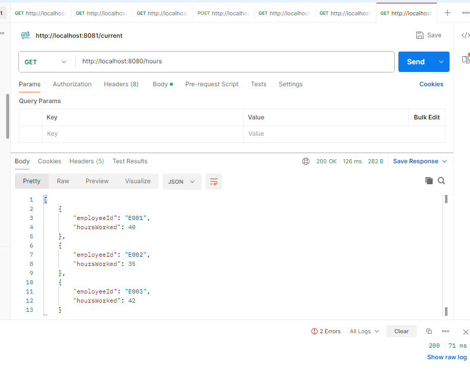
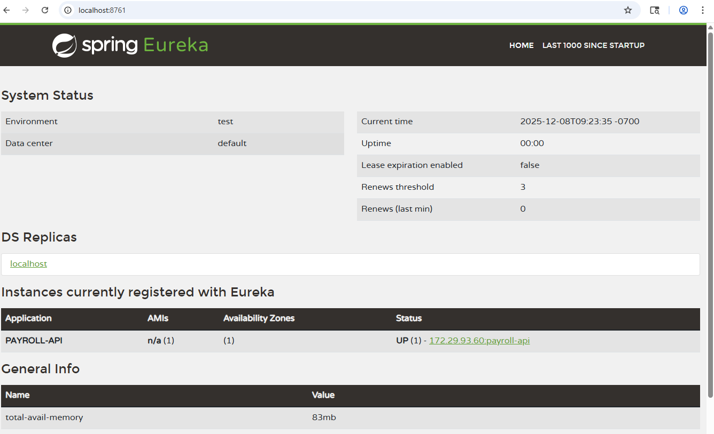
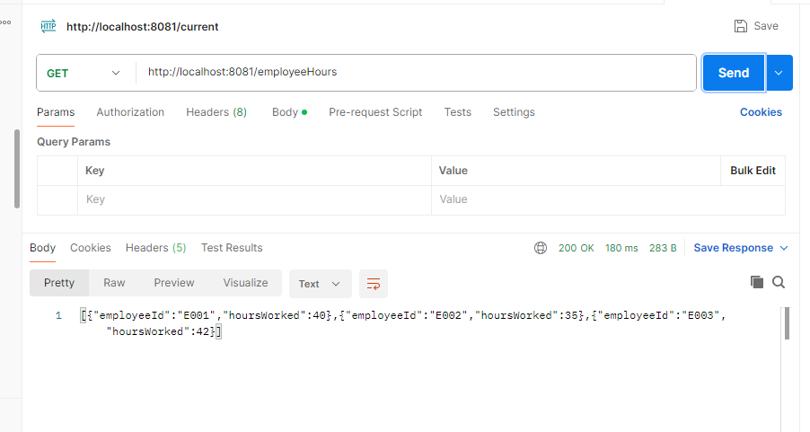

# Lab 2 - Discovery
In this lab you'll set up a Eureka Server and register two services with it.

## Part 1 - Add Eureka Server
To implment discovery, you need a registry service. We will use the Netflix Eureka Server to manage service discovery. With Spring Initalizr, you can quickly create a Eureka server and start using it.

Open your browser and go to [Spring Initalizr](https://start.spring.io)
 - Project: Gradle - Groovy
 - Language: Java
 - Spring Boot: 4.0.0
 - Project Metadata
   - Group: com.example
   - Artifact: eurekaserver
   - Name: eurekaserver
   - Description: Eureka Server for Lab 2
   - Package name: com.example.eurekaserver
- Packaging: Jar
- Configuration: YAML
- Java: 25

Click "Add Dependencies" and search for Eureka Server



Once you've added that dependency, click "Generate"

Unzip the downloaed file into your Lab-2 folder.

From within VS Code, run the server. Next browse to the [Eureka Server](http://localhost:8761/)

You won't see any registered services yet. We'll first register our legacy API, with code that is already in your folder, then add a new API that uses discovery and the legacy API.

## Part 2 - Add Eureka Client to Existing Service
### Step 1 - View API from Postman
Find the payroll-api project and run it from withing VS Code. The default port is 8080, which is fine for this service. The next service will need a different port.

Open Postman and do a GET on https://localhost:8080/hours

You should see something like this:



### Step 2 - Add API to Eureka

In `payroll-api` locate `build.gradle`.
Once you have located the file, add a new dependency for discovery:
`org.springframework.cloud:spring-cloud-starter-netflix-eureka-client`

Then, add the extension an depenency managment to `build.gradle` just before dependencies.
```plaintext
ext {
	set('springCloudVersion', "2025.1.0")
}
```
After `dependencies` add the dependency management section
```plaintext
dependencyManagement {
	imports {
		mavenBom "org.springframework.cloud:spring-cloud-dependencies:${springCloudVersion}"
	}
}
```

Once you have completed these tasks, run the service then go to your browser and refresh. You should see your service registered.



Your service is now ready to be discovered by other services. Next we will create a service that queries payroll.

## Part 3 - Create an Employee API
In this part, you will add the employee-api and use the Eureka discovery service to find and call the hours API.

### Step 1 - Create project
In your browser, start a fresh Initalizr session. Use the same settings as you did in step one except the following:
- Name it 'employee-api'
- Don't add the Eureka server depenency.
  - Add 'Spring Web'
  - Add 'Eureka Discovery Client`

Download the zip and extract it into your lab-2 folder.

### Step 2 - Configure project
The default port is 8080, which conflicts with the payroll-api, so change to 8081.

Locate:
`payroll-api->src->main->resources->application.yaml`
In that file, add port 8081 as the port for the application:
```yaml
server:
  port: 8081
```

### Step 3 - Add a controller that calls payroll-api
In the Explorer in VS Code, browse to src->main->java->com->example->employee_api and add a folder named `controller`

In the controller folder right click and add a Java Class. Name it `EmployeeController`

Add the following imports:
```java
import org.springframework.cloud.client.ServiceInstance;
import org.springframework.cloud.client.discovery.DiscoveryClient;
import org.springframework.web.bind.annotation.GetMapping;
import org.springframework.web.bind.annotation.RestController;
import org.springframework.web.client.RestClient;
```

Decorate the ClassName with `@RestController`

```java
@RestController
public class EmployeeController {
  ...
```

Finally, add the discovery call to return the contents of the payroll-api. We'll not try to parse it at this time, but display the JSON text instead. We'll build on this throughout the class.

```java
@RestController
public class EmployeeController {
    private final DiscoveryClient discoveryClient;
	private final RestClient restClient;

	public EmployeeController(DiscoveryClient discoveryClient, RestClient.Builder restClientBuilder) {
		this.discoveryClient = discoveryClient;
		restClient = restClientBuilder.build();
	}

	@GetMapping("employeeHours")
	public String employeeHours() {
		ServiceInstance serviceInstance = discoveryClient.getInstances("payroll-api").get(0);
		String serviceAResponse = restClient.get()
				.uri(serviceInstance.getUri() + "/hours")
				.retrieve()
				.body(String.class);
		return serviceAResponse;
	}
}
```

Refresh Eureka in your browser. If you see the following warning, you may safely ignore it in this lab.
```plaintext
EMERGENCY! EUREKA MAY BE INCORRECTLY CLAIMING INSTANCES ARE UP WHEN THEY'RE NOT. RENEWALS ARE LESSER THAN THRESHOLD AND HENCE THE INSTANCES ARE NOT BEING EXPIRED JUST TO BE SAFE.
```
We'll get back to that in a future lab.

Run Postman and call http://localhost:8081/employeeHours
You should see a string with the array of hours in JSON format return.



## Conclusion
Congratulations! You've created a microservice enviroment with discovery! In this lab we created a basic Eureka server, upgraded an existing API to register with it, and finally, added a brand new API to call the service.