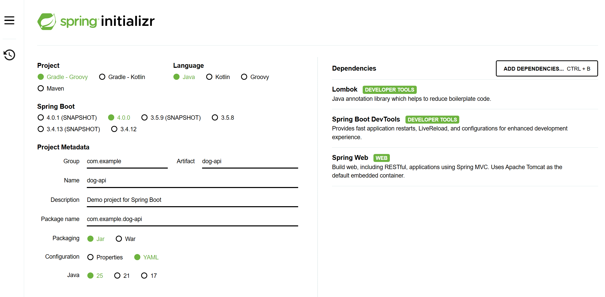

# Lab 4 - Dev Tools and Logging
In this lab you'll create a new RESTful service with Initalizr and demonstrate the dev tools and logging.
## Step 1 - Create application
Open https://start.spring.io in your browser and create a new application.
- Use the same Java version 25.
- Gradle - Groovy
- Spring Boot - 4.0.0
- Artifact: dog-api
- Configuration: YAML
- For dependencies add:
    - Lombok
    - Spring Boot Dev Tools
    - Spring Web

Name the application `dog-api`



Once you have all the settings done, generate the project and unzip it into the lab-4 folder.

Add logging to the `DogApiApplication.java` file with the `@Slf4j` attribute.
 
Add a log in the startup of `log.info("Woof woof");` then build and run debug.

Once you see the log entry write out, update it it to `Woof! Woof!` and use `shift-ctrl-P` to force a rebuild.

Note that the logs show your new Woof!

## Step 2 - Add a Resource
Create a config folder off the `dog_api` folder.
Add a new Java class, KennelProperties. Make sure to include all the getters and

```java
import org.springframework.boot.context.properties.ConfigurationProperties;

@ConfigurationProperties(prefix = "kennel")
public class KennelProperties {

    private String name;
    private String address;
    private int capacity;
    private List<String> sections;


    @Override
    public String toString() {
        return "KennelProperties{name='" + name + '\'' + ", address='" + address + '\'' + ", capacity=" + capacity + ", sections=" + sections + '}';
    }

    public String getName() {
        return name;
    }

    public void setName(String name) {
        this.name = name;
    }
    // Add the rest
    ...
}
```

Add this YAML to your application.yaml file.
```yaml
kennel:
  name: "Happy Tails Kennel"
  address: "123 Bark Street"
  capacity: 50
  sections:
    - puppies
    - adults
    - seniors
```
Implement the properties in the KennelProperties class.

## Step 3 - Add a Controller
Here, we will create a RESTful controller to return the kennel properties so we can test them.

- Create a new `controller` folder off the `dog_api` folder.
- Add a new java class callsed `KennelController`.
- Inject the KennelProperites through the constructor.
- Set the mapping to a `/kennel` route to return the kennel properites.
- Verify it builds.

```java
package com.example.dog_api.controller;

import org.springframework.web.bind.annotation.GetMapping;
import org.springframework.web.bind.annotation.RestController;

import com.example.dog_api.config.KennelProperties;

@RestController
public class KennelController {
    private final KennelProperties kennel;

    public KennelController(KennelProperties kennel) {
        this.kennel = kennel;
    }

    @GetMapping("/kennel")
    public KennelProperties getKennel() {
        return kennel;
    }
}
```

## Step 4 - Test in Postman
- Run or debug the api.
- In post man do a GET request at http://localhost:8080/kennel
- Verify you see the kennel properties.
