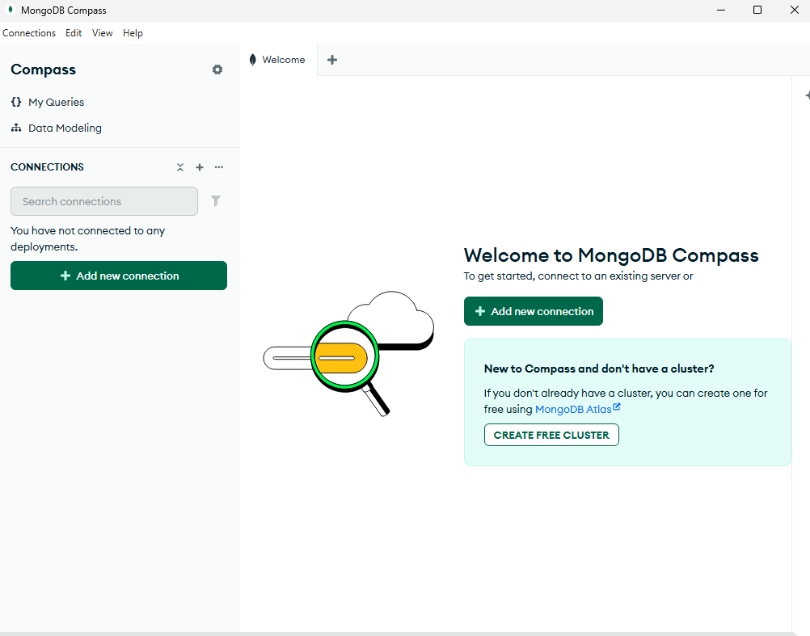
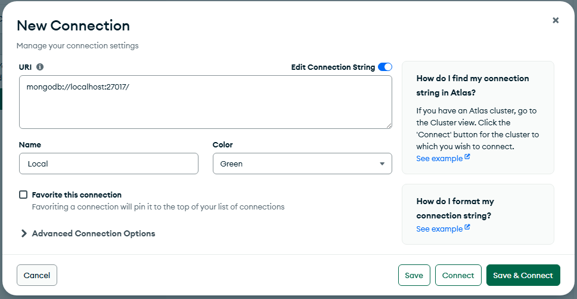
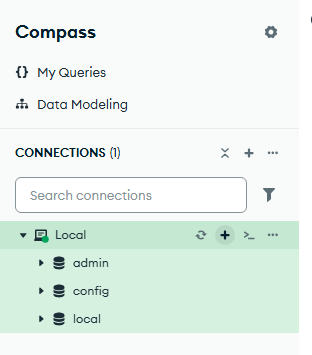
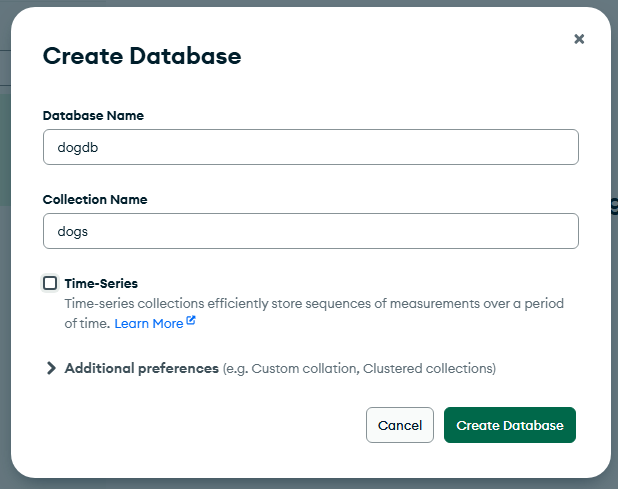

# Lab 8 - Database Connections
In this lab you will connect to a MongoDB instance and create a database and collection for the dogs.
Note: While, we will create the database and collection MongoDB Compass, this is for demonstration purposes only. It is not necessary to pre-create your database and collections as MongoDB will provision them at run time when you first try to use them.

## Step 1 - Create a database
To manually create a database, launch the MongoDB Compass app. The icon should be on your desktop.

1. Find the '+' button on the db explorer next to CONNECTIONS.

2. Click the plus and put in the local host information. Give the connection a name and a custom color if you wish. In the example the color is set to green.

3. Now that you have a connection, you can create a database and connection.
4. Find the '+' button by the database list.

5. Click the '+' and create a database called 'dogdb' and a collection called 'dogs'.


Now you have a database and collection to work with. While the db and collection can, and most likely, will be created in code in your apps, this gets us started.

## Step 2 - Add the MongoDB package
We will no longer use an in-memory store for the dogs, but use MongoDB. We must add a connection and drivers.
1. Add a new package in Gradle: `implementation 'org.springframework.boot:spring-boot-starter-data-mongodb'`
2. Update the Dog model to have a string for the Id instead of a long. This is for how MongoDB stores IDs.
```Java
public class Dog {
    private String id;
    ...

    public Dog(String id, String name, String breed, Integer age, String color) {
        this.id = id;
        this.name = name;
        this.breed = breed;
        this.age = age;
        this.color = color;
    }
    ...
}
```
3. Add packages for MongoDB annotations.
```java
import org.springframework.data.annotation.Id;
import org.springframework.data.mongodb.core.mapping.Document;

@Document(collection = "dogs")
public class Dog {

    @Id
    private String id;
    private String name;
    ...
}
```
You have now configured the Dog POJO for MongoDB. Next we will update the repository to not use a HashMap, rather to talk to MongoDB.

## Step 3 - Update repository
We will no longer need the CanineContract, we will eventually remove the file. Instead we will implment the MongoRepository.
1. In the DogRepository.java file, remove all the HashMap imports and replace them with a MongoDB import. `import org.springframework.data.mongodb.repository.MongoRepository;`
2. Delete all the DogRepository code and replace it with a simplified repository interface. Spring will generate the actual code to use the repository.
```java
public interface DogRepository extends MongoRepository<Dog, String> {
}
```
3. At this point, delete the CanineContract file.
We are now ready to update the controller and configure the connection for the application.

## Step 4 - Configure the MongoDB connection
1. Update the application.yaml for the MongoDB connection.
```yaml
spring:
  application:
    name: dog-api
  data:
    mongodb:
      host: localhost
      port: 27017
      database: dogdb
```
* Note: The database might be ignored and everything write to the 'test' database. That's okay for the lab.
## Step 5 - Update the DogController to use the new repository
1. Update the package imports.
```java
import com.example.dog_api.entity.Dog;
import com.example.dog_api.repository.DogRepository;

import io.swagger.v3.oas.annotations.tags.Tag;

import org.springframework.web.bind.annotation.*;

import java.util.Collection;
```
2. Change the injection to take a MongoDB interface as defined by the DogRepository.
```java

@RestController
@RequestMapping("/dogs")
public class DogController {

    private final DogRepository dogRepository;

    public DogController(DogRepository dogRepository) {
        this.dogRepository = dogRepository;
    }


    @Tag(name = "Read Operations")
    @GetMapping("/{id}")
    public Dog getDogById(@PathVariable String id) {
        return dogRepository.findById(id).orElse(null)   ;
    }

    @Tag(name = "Read Operations")
    @GetMapping
    public Collection<Dog> getAllDogs() {
        return dogRepository.findAll();
    }

    @Tag(name = "Write Operations")
    @PostMapping
    public void addDog(@RequestBody Dog dog) {
        dogRepository.save(dog);
    }

    @Tag(name = "Write Operations")
    @PutMapping("/{id}")
    public void updateDog(@PathVariable String id, @RequestBody Dog dog) {
        dogRepository.save(dog);
    }

    @Tag(name = "Write Operations")
    @DeleteMapping("/{id}")
    public void deleteDog(@PathVariable String id) {
        dogRepository.deleteById(id);
    }
}
```
You have now converted to MongoDB from in memory.
## Step 6 - Test and Debug
Run the application and use the Swagger page to add, update, and remove dogs.
# Conclusion
You've connected to a database! You can now persist data between sessions and have a better idea how to use a document database like MongoDB.
