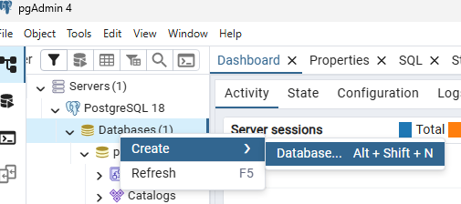
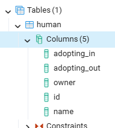
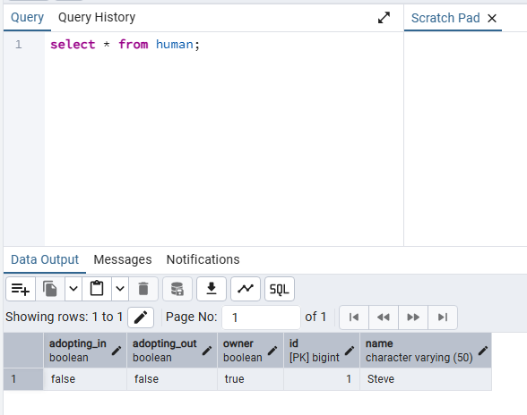

# Lab 9 - JPA with Hibernate
In this lab you'll add a PostgreSQL backend to the REST services.
## Step 1 - Create databasse in pgAdmin
1. Run pgAdmin (should be in your taskbar)
2. Expand the 'Servers' menu on the left.
3. When prompted, put in the postgres password: p@ssw0rd1
4. Create a new database named 'humandb'


5. Minimize pgAdmin and return to VS Code

It is recommended to use migrations instead of hand building. That is beyond the scope of this lab.
Two great migration libraries are:
- Liquibase
- Flyaway

## Step 2 - Add JPA Packages to Project
1. Add the following two entries to your gradle.build file.
```plaintext
implementation 'org.springframework.boot:spring-boot-starter-data-jpa'
runtimeOnly 'org.postgresql:postgresql'
```
2. Update the application.yaml file with the datasource and jpa settings.
```yaml
spring:
  ...
  datasource:
    url: jdbc:postgresql://localhost:5432/humandb
    username: postgres
    password: p@ssw0rd1
    driver-class-name: org.postgresql.Driver
  jpa:
    hibernate:
      ddl-auto: create
      show-sql: true
      properties:
      hibernate:
        format_sql: true
```
3. Run the application and verify it connects to the database in the output.

## Step 3
Updte the Human entity to work with the JPA.

1. Import the required packages to decorate the entity.
```java
import jakarta.persistence.Entity;
import jakarta.persistence.GeneratedValue;
import jakarta.persistence.GenerationType;
import jakarta.persistence.Id;
import jakarta.persistence.Column;
```
2. Add the @Entity attribute to the class.
3. Update the id to be an @Id
4. Also for the id, make it generated: `@GeneratedValue(strategy = GenerationType.IDENTITY)`
5. Set the @Column of name to have a `length = 50`
6. Run the application and veriy there are no errors.
7. Return to pgAdmin and open `humandb` and expand the public schema
8. Expand tables and verify the `human` table was created.



9. Minimize pgAdmin and shutdown the Java app.

## Step 4 - Create Repository
Create the human repository to manage database access.
1. Create a `repository` folder off of the `...\example\human_api` folder.
2. Add a new Java class and name it HumanRepository.
3. JPA repositories are interfaces that can take custom code. Use the default interface for now.
```java
package com.example.human_api.repository;

import org.springframework.data.jpa.repository.JpaRepository;

import com.example.human_api.entity.Human;

public interface HumanRepository extends JpaRepository<Human, Long> {
    // Custom queries can go here
}
```

## Step 5 - Update the API to Access DB
1. In the HumanController, add the code to inject the repository.
```java
...
import com.example.human_api.entity.Human;
import com.example.human_api.repository.HumanRepository;
...
    public HumanController(HumanRepository humanRepository) {
        this.humanRepository = humanRepository;
    }
```
2. Updte the two routes to return the correct types instead of stubbed in strings.
```java
    @GetMapping("/{id}")
    public Human getHumanById(@PathVariable("id") Long id) {
        return humanRepository.findById(id).orElse(null);
    }

    @GetMapping
    public List<Human> getAllHumans() {
        return humanRepository.findAll();
    }
```
3. Build and test with Swagger.

## Step 6 - Add Write Operations
In this step, add POST, PUT, and DELETE methods to the API. 

**Note:** When POSTing a new human, do not pass in the id field in your JSON when you test. It is to be auto-generated and if you pass one it, it might error.

Once you have added some data, you can view it in pgAdmin with the Query tool.


## Step 7 - Add a Custom Query
With JPA custom queries can be done by convention and with custom SQL. We will add one by convention that will query humans that are also owners. In this example we use the keyword of `find`, a modifier of `By`, the field name `Owner`, and the value `True`

```java
public interface HumanRepository extends JpaRepository<Human, Long> {
    List<Human> findByOwnerTrue();
}
```
Once you have that added to the existing HumanRepository, update the HumanController with a new route of `/owners` that returns the results of the custom query.

# Conclusion
You've created a microservice with it's own backing database and use very little code to do it.